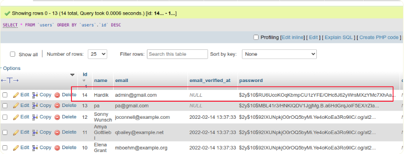

# laravel9_database_seeder
Create Seeder Class:
```Dockerfile
php artisan make:seeder AdminUserSeeder
```
- Vào database/seeders/AdminUserSeeder.php
```Dockerfile
<?php
  
namespace Database\Seeders;
  
use Illuminate\Database\Console\Seeds\WithoutModelEvents;
use Illuminate\Database\Seeder;
use App\Models\User;
  
class AdminUserSeeder extends Seeder
{
    /**
     * Run the database seeds.
     *
     * @return void
     */
    public function run()
    {
        User::create([
            'name' => 'Hardik',
            'email' => 'admin@gmail.com',
            'password' => bcrypt('123456'),
        ]);
    }
}
```
## 1: Run Single Seeder
```Dockerfile
php artisan db:seed --class=AdminUserSeeder
```
- Vào database/seeders/DatabaseSeeder.php
```Dockerfile
<?php
  
namespace Database\Seeders;
  
use Illuminate\Database\Console\Seeds\WithoutModelEvents;
use Illuminate\Database\Seeder;
  
class DatabaseSeeder extends Seeder
{
    /**
     * Seed the application's database.
     *
     * @return void
     */
    public function run()
    {
        $this->call(AdminUserSeeder::class);
    }
}
```
- Vào terminal :
```Dockerfile
php artisan db:seed
```
- Bạn có thể thấy một hàng cơ sở dữ liệu sẽ được tạo trên bảng người dùng:


